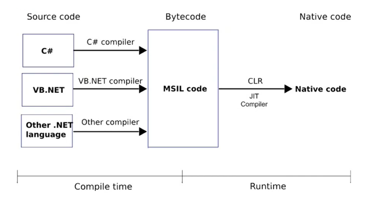
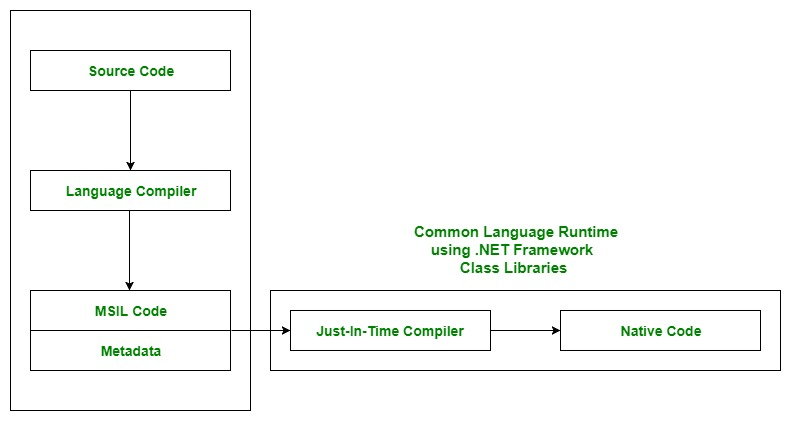
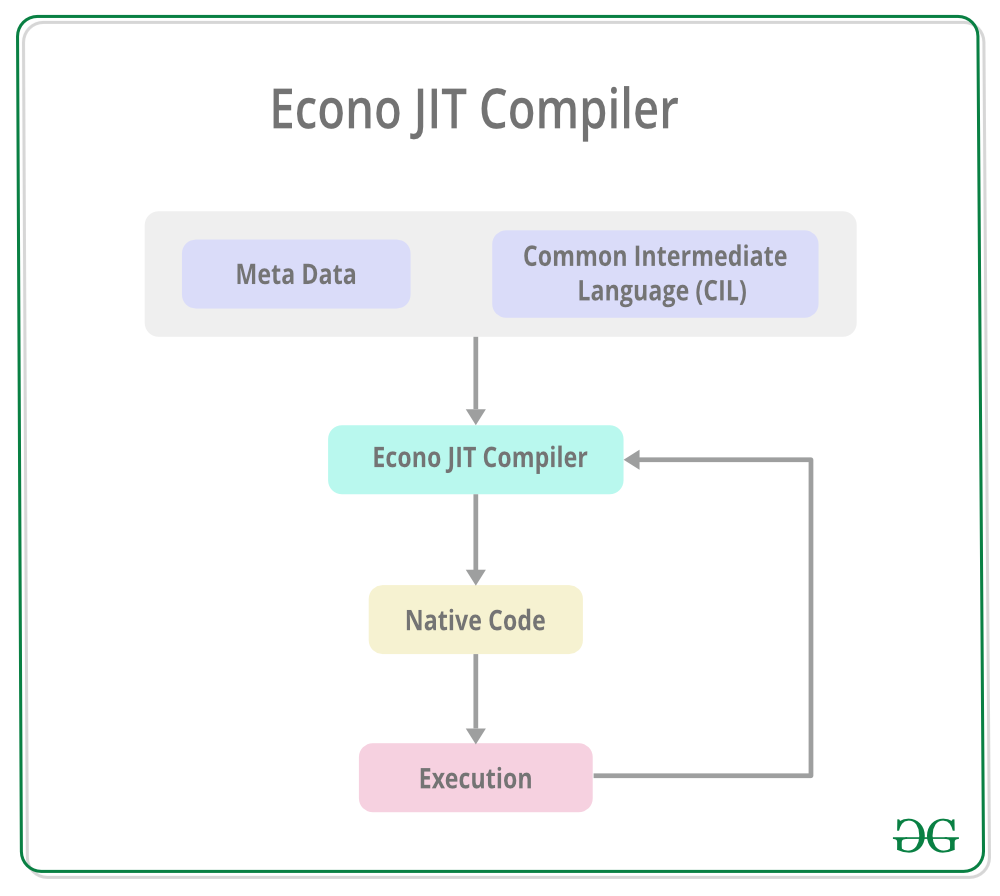
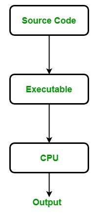

# .NET

The .NET is a free, cross-platform, open-source developer platform by Microsoft that provides a runtime environment and a set of libraries and tools for building and running applications. The framework includes a variety of programming languages, such as C#, F#, and Visual Basic, and supports a range of application types, including desktop, web, mobile, and gaming applications.

The .NET platform has been designed to deliver productivity, performance, security, and reliability. It provides automatic memory management via a **garbage collector (GC)**.

It is type-safe and memory-safe, due to using a GC and strict language compilers. It offers concurrency via *async/await* and *Task* primitives.

*image by Vishalnayan on WordPress.com*

---

### CIL or MSIL or IL

*image by https://www.geeksforgeeks.org/*

* The source code is converted into the MSIL by a language-specific compiler in the compile time of the CLR. Also, along with the MSIL, metadata is also produced in the compilation. The metadata contains information such as the definition and signature of the types in the code, runtime information, etc.
* A Common Language Infrastructure (CLI) assembly is created by assembling the MSIL. This assembly is basically a compiled code library that is used for security, deployment, versioning, etc. and it is of two types i.e. process assembly (EXE) and library assembly (DLL).
* The JIT compiler then converts the Microsoft Intermediate Language(MSIL) into the machine code that is specific to the computer environment that the JIT compiler runs on. The MSIL is converted into the machine code on a requirement basis i.e. the JIT compiler compiles the MSIL as required rather than the whole of it.
* The machine code obtained using the JIT compiler is then executed by the processor of the computer.

## Components

*image by https://www.geeksforgeeks.org/*

The .NET Framework includes two main components: the Common Language Runtime (CLR) and the .NET Framework Class Library. The CLR is responsible for managing the execution of code written in any of the supported languages, while the class library provides a large set of pre-built functions and classes that can be used to create a wide range of applications.

* **Common Language Runtime(CLR):** CLR is the basic and Virtual Machine component of the .NET Framework. **It is the run-time environment in the .NET Framework** that runs the codes and helps in making the development process easier by providing various services such as remoting, thread management, type safety, memory management, robustness, etc. Basically, it is responsible for managing the execution of .NET programs regardless of any .NET programming language. It also helps in the management of code, as code that targets the runtime is known as *Managed Code*, and code that doesn’t target to runtime is known as *Unmanaged code*. 

* **Framework Class Library(FCL):** It is the collection of reusable, object-oriented class libraries and methods, etc that can be integrated with CLR. Also called the Assemblies. It is just like the header files in C/C++ and packages in java. Installing the .NET framework basically is the installation of CLR and FCL into the system. Below is the overview of the .NET Framework. 

> The code that runs under the Common Language Runtime is termed as the **Managed Code**

---

### FCL (Framework Class Library)

The Framework Class Library or FCL provides the system functionality in the *.NET Framework* as it has various classes, data types, interfaces, etc. to perform multiple functions and build different types of applications such as desktop applications, web applications, mobile applications, etc. The Framework Class Library is integrated with the **Common Language Runtime (CLR)** of the .NET framework and is used by all the .NET languages such as C#, F#, Visual Basic .NET, etc.

**Categories in the Framework Class Library**

The functionality of the Framework Class Library can be broadly divided into three categories i.e *utility features written in .NET*, *wrappers around the OS functionality* and *frameworks*. These categories are not rigidly defined and there are many classes that may fit into more than one category. 

*image by https://www.geeksforgeeks.org/*

Details about the Categories in the Framework Class Library are given as follows: 

* **Utility Features:** The utility features in the FCL includes various collection classes such as list, stack, queue, dictionary, etc. and also classes for more varied manipulations such as Regex class for regular expressions.
* **Wrappers Around OS functionality:** Some of the features in the FCL are wrappers around the underlying Windows OS functionality. These include the classes for using the file system, the classes to handle the network features, the classes to handle I/O for console applications, etc.
* **Frameworks:** There are various frameworks available in the FCL to develop certain applications. For example, ASP.NET is used to develop web applications, Windows Presentation Foundation (WPF) is used to render user interfaces in Windows applications, and so on.

---

### CLR (Common Language Runtime)

Below diagram illustrate how CLR is associated with the operating system/hardware along with the class libraries. Here, the runtime is actually CLR.

*image by https://www.geeksforgeeks.org/*

---

#### Role of CLR in the execution of a C# program

* Suppose you have written a C# program and save it in a file which is known as the Source Code.
* Language specific compiler compiles the source code into the MSIL(Microsoft Intermediate Language) which is also known as the CIL(Common Intermediate Language) or IL(Intermediate Language) along with its metadata. Metadata includes all the types, actual implementation of each function of the program. MSIL is machine-independent code.
* Now CLR comes into existence. CLR provides the services and runtime environment to the MSIL code. Internally CLR includes the JIT(Just-In-Time) compiler which converts the MSIL code to machine code which further executed by CPU. CLR also uses the .NET Framework class libraries. *Metadata* provides information about the programming language, environment, version, and class libraries to the CLR by which CLR handles the MSIL code. As CLR is common so it allows an instance of a class that written in a different language to call a method of the class which written in another language.

*image by https://www.geeksforgeeks.org/*

---

#### Main Components of CLR

**Common Language Specification (CLS):** 
It is responsible for converting the different .NET programming language syntactical rules and regulations into CLR understandable format. Basically, it provides Language Interoperability. Language Interoperability means providing execution support to other programming languages also in .NET framework. 

**Language Interoperability can be achieved in two ways :**

1. **Managed Code:** The MSIL code which is managed by the CLR is known as the Managed Code. For managed code CLR provides **three** .NET facilities: 
2. **Unmanaged Code:** Before .NET development, programming languages like.COM Components & Win32 API do not generate the MSIL code. So these are not managed by CLR rather managed by Operating System.

**Common Type System (CTS):**
Every programming language has its own data type system, so CTS is responsible for understanding all the data type systems of .NET programming languages and converting them into CLR understandable format which will be a common format. 

*There are 2 Types of CTS that every .NET programming language have :* 

1. **Value Types:** Value Types will store the value directly into the memory location. These types work with stack mechanisms only. CLR allows memory for these at Compile Time.
2. **Reference Types:** Reference Types will contain a memory address of value because the reference types won’t store the variable value directly in memory. These types work with Heap mechanism. CLR allot memory for these at Runtime.

**Garbage Collector:** 
It is used to provide the Automatic Memory Management feature. If there was no garbage collector, programmers would have to write the memory management codes which will be a kind of overhead on programmers. 

**JIT(Just In Time Compiler):** 
It is responsible for converting the CIL(Common Intermediate Language) into machine code or native code using the Common Language Runtime environment. 

---

### JIT Compiler

The JIT compiler converts the Microsoft Intermediate Language(MSIL) or Common Intermediate Language(CIL) into the machine code. This is done before the MSIL or CIL can be executed. The MSIL is converted into machine code on a requirement basis i.e. *the JIT compiler compiles the MSIL or CIL as required rather than the whole of it.* The compiled MSIL or CIL is stored so that it is available for subsequent calls if required. 

**Types of Just-In-Time Compiler:** There are **3** types of JIT compilers which are as follows: 

* **Pre-JIT Compiler:** All the source code is compiled into the machine code at the same time in a single compilation cycle using the Pre-JIT Compiler. This compilation process is performed at application deployment time. And this compiler is always implemented in the **Ngen.exe (Native Image Generator)**.

*image by https://www.geeksforgeeks.org/*

* **Normal JIT Compiler:** The source code methods that are required at run-time are compiled into machine code the first time they are called by the Normal JIT Compiler. After that, they are stored in the cache and used whenever they are called again. 

*image by https://www.geeksforgeeks.org/*

* **Econo JIT Compiler:** The source code methods that are required at run-time are compiled into machine code by the Econo JIT Compiler. After these methods are not required anymore, they are removed. This JIT compiler is obsolete starting from dotnet 2.0

*image by https://www.geeksforgeeks.org/*

**Advantages of JIT Compiler:**

* The JIT compiler requires less memory usage as only the methods that are required at run-time are compiled into machine code by the JIT Compiler.
* Page faults are reduced by using the JIT compiler as the methods required together are most probably in the same memory page.
* Code optimization based on statistical analysis can be performed by the JIT compiler while the code is running.

**Disadvantages of JIT compiler:**

* The JIT compiler requires more startup time while the application is executed initially.
* The cache memory is heavily used by the JIT compiler to store the source code methods that are required at run-time.

**Note:** Much of the disadvantages of the JIT compiler can be handled using the *Ahead-of-time (AOT)* compilation. This involves compiling the MSIL into machine code so that runtime compilation is not required and the machine code file can be executed natively.

---

## Managed and Unmanaged code

### Difference between Managed and Unmanaged code in .NET

A code which is written to aimed to get the services of the managed runtime environment execution like **CLR(Common Language Runtime)** in *.NET Framework* is known as **Managed Code**. It always implemented by the managed runtime environment instead of directly executed by the operating system. The managed runtime environment provides different types of services like garbage collection, type checking, exception handling, bounds checking, etc. to code automatically without the interference of the programmer. It also provides memory allocation, type safety, etc to the code. The application is written in the languages like Java, C#, VB.Net, etc. are always aimed at runtime environment services to manage the execution and the code written in these types of languages are known as managed code. In the case of .NET Framework, the compiler always compiles the manages code in the intermediate language(MSIL) and then create an executable. When the programmer runs the executable, then the **Just In Time Compiler** of CLR compiles the intermediate language in the native code which is specific to the underlying architecture. Here this process is taking place under a managed runtime execution environment so this environment is responsible for the working of the code. The execution of managed code is as shown in the below image, the source code is written in any language of .NET Framework.

**What are the advantages of using Managed Code?**

* It improves the security of the application like when you use runtime environment, it automatically checks the memory buffers to guard against buffer overflow.
* It implement the garbage collection automatically.
* It also provides runtime type checking/dynamic type checking.
* It also provides reference checking which means it checks whether the reference point to the valid object or not and also check they are not duplicate.

**What are the disadvantages of Managed Code?**

* The main disadvantage of managed language is that you are not allowed to allocate memory directly, or you cannot get the low-level access of the CPU architecture.

*image by https://www.geeksforgeeks.org/*

**What is Unmanaged code?**

A code which is directly executed by the operating system is known as Unmanaged code. It always aimed for the processor architecture and depends upon computer architecture. When this code is compiled it always tends to get a specific architecture and always run on that platform, in other words, whenever you want to execute the same code for the different architecture you have to recompile that code again according to that architecture. It always compiles to the native code that is specific to the architecture. In unmanaged code, the memory allocation, type safety, security, etc are managed by the **developer**. Due to this, there are several problems related to memory occur like buffer overflow, memory leak, pointer override, etc. The executable files of unmanaged code are generally in binary images, x86 code which is directly loaded into memory. The application written in VB 6.0, C, C++, etc are always in unmanaged code. The execution of unmanaged code is as shown in the below image:

*image by https://www.geeksforgeeks.org/*

**What are the advantages of using Unmanaged Code?**

* It provides the low-level access to the programmer.
* It also provides direct access to the hardware.
* It allows the programmer to bypass some parameters and restriction that are used by the managed code framework.

**What are the disadvantages of Unmanaged Code?**

* It does not provide security to the application.
* Due to the access to memory allocation the issues related to memory occur like memory buffer overflow, etc.
* Error and exceptions are also handled by the programmer.
* It does not focus on garbage collection.

| Managed Code | Unmanaged Code |
|---|---|
| It is executed by managed runtime environment or managed by the CLR. | It is executed directly by the operating system. |
| It provides security to the application written in .NET Framework. | It does not provide any security to the application. |
| Memory buffer overflow does not occur. | Memory buffer overflow may occur. |
| It provide runtime services like Garbage Collection, exception handling, etc.	| It does not provide runtime services like Garbage Collection, exception handling, etc. |
| The source code is compiled in the intermediate language known as IL or MSIL or CIL. | The source code directly compiles into native languages. |
| It does not provide low-level access to the programmer. | It provide low-level access to the programmer. |
| Memory is managed by CLR’s Garbage Collector. | Memory is managed by the programmer. |
| Performance is Slightly slower due to the overhead of memory management and JIT compilation. | Performance is Faster due to direct access to system resources and compiled machine-specific code. |
| Debugging is easier due to the availability of CLR’s debugging tools.	| Debugging is harder due to lack of debugging tools. |
| Managed code requires installation of CLR on the target machine | Unmanaged code Can be distributed as a standalone executable or DLL file. |
| Interoperates well with other .NET languages and libraries. | Limited interoperability with .NET languages . |
| Runs on any platform that has CLR installed. | Runs only on the specific platform for which it is . |

---

### Basic Architecture and Component Stack of .NET Framework

1. **CLR (Common Language Runtime):** It is a run-time environment that executes the code written in any .NET programming language. .Net framework provides support for many languages like C#, F#, C++, Cobra, Jscript.Net, VB.Net, Oxygene, etc.

2. **FCL (Framework Class Library):** A large number of class libraries are present in this framework which is known as FCL.

3. **Types of Applications:** Mainly the applications that are built in the .Net framework are divided into the following three categories :

    * **WinForms:** Form–Based applications are considered under this category. In simple terms, we can say client-based applications that read and write the file system come under this category.
    * **ASP .NET:** Web-based applications come under this category. ASP.Net is a framework for the web and it provides an awesome integration of HTML, CSS, and JavaScript which makes it useful to develop web applications, websites, and web services. Web services were added in .Net Framework 2.0 and considered as a part of ASP.NET web applications.
    * **ADO .NET:** It includes the applications that are developed to communicate with the database like MS SQL Server, Oracle, etc. It mainly consists of classes that can be used to connect, retrieve, insert, and delete data.
4. **WPF (Windows Presentation Foundation):** Windows Presentation Foundation (WPF) is a graphical subsystem given by Microsoft that uses DirectX and is used in Windows-based applications for rendering UI (User Interface). WPF was initially released as part of .NET Framework 3.0 in 2006 and was previously known as “Avalon”.

5. **WCF (Windows Communication Foundation):** It is a framework for building connected and service-oriented applications used to transmit data asynchronously from one service endpoint to another service point. It was previously known as the Indigo.

6. **WF (Windows Workflow Foundation):** It is a technology given by Microsoft that provides a platform for building workflows within .Net applications.

7. **Card Space:** It is a Microsoft .NET Framework software client that is designed to let users provide their digital identity to online services in a secure, simple, and trusted way.

8. **LINQ (Language Integrated Query):** It is introduced in .Net framework version 3.5. Basically, it is a query language used to make the query for data sources with VB or C# programming languages.

9. **Entity Framework:** It is an open–source ORM (Object Relational Mapping) based framework that comes into .Net Framework version 3.5. It enables the .Net developer to work with a database using .Net objects. Before the entity framework, .Net developers performed a lot of things related to databases. Like to open a connection to the database, developers have to create a Data Set to fetch or submit the data to the database, convert data from the Data Set to .NET objects, or vice-versa. It creates difficulties for developers and also it was an error-prone process, then “Entity Framework” comes to automate all these database-related activities for the application. So, Entity Framework allows the developers to work at a higher level of abstraction. 

    **Note:** **REST (Representational State Transfer)** and **AJAX** were added in .Net Framework 3.5 as an extension and services of ASP.NET for enhancing web services of .NET Framework.

10. **Parallel LINQ (Language Integrated Query):** It comes in .Net Framework version 4.0 and is also termed PLINQ. It provides a concurrent query execution engine for LINQ. It executes the LINQ in parallel such that it tries to use as much processing power the system on which it is executing.

11. **TPL (Task Parallel Library):** It is a set of public types and APIs. It allows the developers to be more productive by simplifying the process of adding concurrency and parallelism to .Net applications.

12. **.NET API For Store/UWP Apps:** In 2012, Microsoft added some APIs for creating UWP(Universal Windows Platform) apps for Windows using C# or VB.

13. **Task-Based Asynchronous Model:** It is a model used to describe the asynchronous operations and tasks in the .Net Framework.

---

## Abbreviations

* CIL - Common Intermediate Language | MSIL - Microsoft Intermediate Language | IL - Intermediate Language
* CLR - Common Language Runtime
* CLI - Common Language Infrastructure
* CTS - Common Type System
* CLS - Common Language Specification
* JIT - Just In Time Compiler
* FCL - Framework Class Libraries
* BCL - Base Class Libraries
* SDK - Software Development Kit

## .NET ecosystem

.NET implementations:

* **.NET Framework** -- The original .NET. It provides access to the broad capabilities of Windows and Windows Server. It is actively supported, in maintenance.
* **Mono** -- The original community and open source .NET. A cross-platform implementation of .NET Framework. Actively supported for Android, iOS, and WebAssembly.
* **.NET (Core)** -- Modern .NET. A cross-platform and open source implementation of .NET, rethought for the cloud age while remaining significantly compatible with .NET Framework. Actively supported for Linux, macOS, and Windows.

## Where is .NET used? 

*image by Microsoft*

## Links

* *Microsoft Learn* https://learn.microsoft.com/
* *GeeksForGeeks* https://www.geeksforgeeks.org/
* *Vishalnayan* on WordPress.com

**GeeksForGeeks**
* *Introduction to .NET Framework* https://www.geeksforgeeks.org/introduction-to-net-framework/
* *Common Language Runtime (CLR) in C#* https://www.geeksforgeeks.org/common-language-runtime-clr-in-c-sharp/?ref=lbp 
* *CIL or MSIL | Microsoft Intermediate Language or Common Intermediate Language* https://www.geeksforgeeks.org/cil-or-msil-microsoft-intermediate-language-or-common-intermediate-language/
* *Managed code and Unmanaged code in .NET* https://www.geeksforgeeks.org/managed-code-and-unmanaged-code-in-net/
* *Difference between Managed and Unmanaged code in .NET* https://www.geeksforgeeks.org/difference-between-managed-and-unmanaged-code-in-net/
* *.NET Framework Class Library (FCL)* https://www.geeksforgeeks.org/net-framework-class-library-fcl/
* *C# | .NET Framework (Basic Architecture and Component Stack)* https://www.geeksforgeeks.org/c-sharp-net-framework-basic-architecture-component-stack/?ref=lbp
* *What is Just-In-Time(JIT) Compiler in .NET* https://www.geeksforgeeks.org/what-is-just-in-time-jit-compiler-in-dot-net/

**Microsoft**
* *Introduction to NET* https://learn.microsoft.com/en-us/dotnet/core/introduction
* *.NET class libraries* https://learn.microsoft.com/en-us/dotnet/standard/class-libraries
* *.NET Standard* https://learn.microsoft.com/en-us/dotnet/standard/net-standard
* *.NET glossary* https://learn.microsoft.com/en-us/dotnet/standard/glossary
