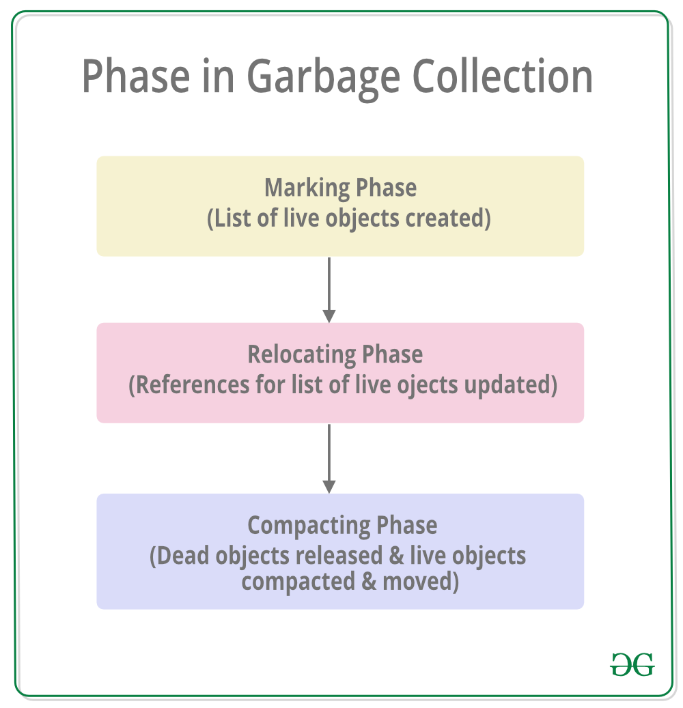
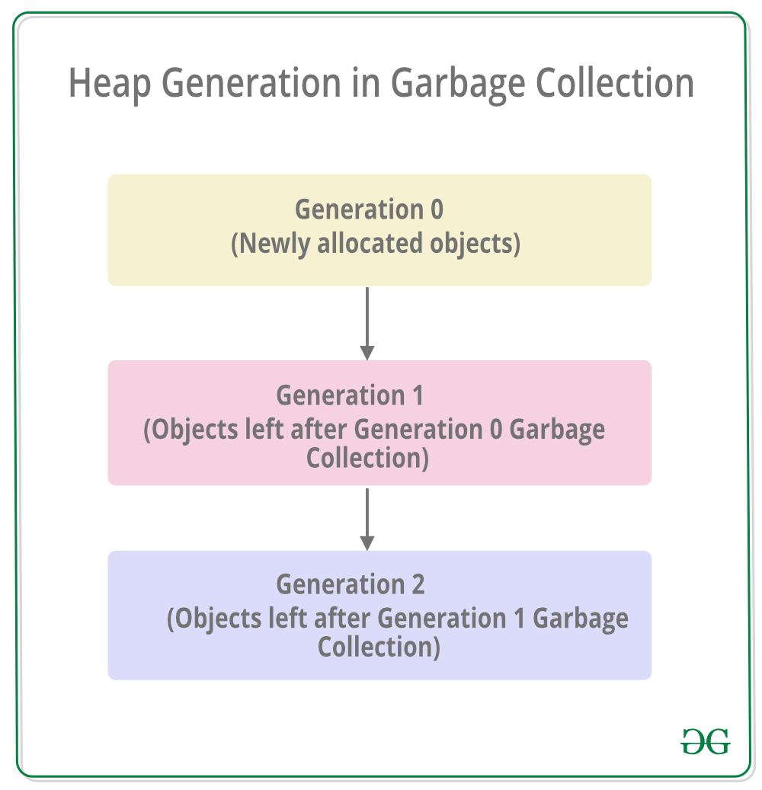

# Garbage Collection in .NET

Garbage collection is a memory management technique used in the .NET Framework and many other programming languages. In C#, the garbage collector is responsible for managing memory and automatically freeing up memory that is no longer being used by the application.

The garbage collector works by periodically scanning the application’s memory to determine which objects are still being used and which are no longer needed. Objects that are no longer being used are marked for garbage collection, and their memory is freed up automatically by the garbage collector.

Automatic memory management is made possible by Garbage Collection in .NET Framework. When a class object is created at runtime, a certain memory space is allocated to it in the heap memory. However, after all the actions related to the object are completed in the program, the memory space allocated to it is a waste as it cannot be used. In this case, garbage collection is very useful as it automatically releases the memory space after it is no longer required. 
Garbage collection will always work on **Managed Heap** and internally it has an Engine which is known as the **Optimization Engine**. Garbage Collection occurs if at least one of multiple conditions is satisfied. These conditions are given as follows:

* If the system has low physical memory, then garbage collection is necessary.
* If the memory allocated to various objects in the heap memory exceeds a pre-set threshold, then garbage collection occurs.
* If the GC.Collect method is called, then garbage collection occurs. However, this method is only called under unusual situations as normally garbage collector runs automatically.

### Phases in Garbage Collection

There are mainly **3** phases in garbage collection. Details about these are given as follows: 

*image by https://www.geeksforgeeks.org/*

1. **Marking Phase:** A list of all the live objects is created during the marking phase. This is done by following the references from all the root objects. All of the objects that are not on the list of live objects are potentially deleted from the heap memory.
2. **Relocating Phase:** The references of all the objects that were on the list of all the live objects are updated in the relocating phase so that they point to the new location where the objects will be relocated to in the compacting phase.
3. **Compacting Phase:** The heap gets compacted in the compacting phase as the space occupied by the dead objects is released and the live objects remaining are moved. All the live objects that remain after the garbage collection are moved towards the older end of the heap memory in their original order. 

### Heap Generations in Garbage Collection

The heap memory is organized into 3 generations so that various objects with different lifetimes can be handled appropriately during garbage collection. The memory to each Generation will be given by the **Common Language Runtime(CLR)** depending on the project size. Internally, Optimization Engine will call the *Collection Means Method* to select which objects will go into Generation 1 or Generation 2.

*image by https://www.geeksforgeeks.org/*

* **Generation 0 :** All the short-lived objects such as temporary variables are contained in the generation 0 of the heap memory. All the newly allocated objects are also generation 0 objects implicitly unless they are large objects. In general, the frequency of garbage collection is the highest in generation 0.
* **Generation 1 :** If space occupied by some generation 0 objects that are not released in a garbage collection run, then these objects get moved to generation 1. The objects in this generation are a sort of buffer between the short-lived objects in generation 0 and the long-lived objects in generation 2.
* **Generation 2 :** If space occupied by some generation 1 objects that are not released in the next garbage collection run, then these objects get moved to generation 2. The objects in generation 2 are long lived such as static objects as they remain in the heap memory for the whole process duration.

**Note:** Garbage collection of a generation implies the garbage collection of all its younger generations. This means that all the objects in that particular generation and its younger generations are released. Because of this reason, the garbage collection of generation 2 is called a full garbage collection as all the objects in the heap memory are.released. Also, the memory allocated to the Generation 2 will be greater than Generation 1’s memory and similarly the memory of Generation 1 will be greater than Generation 0’s memory(**Generation 2 > Generation 1 > Generation 0**).

### Benefits of Garbage Collection

* Garbage Collection succeeds in allocating objects efficiently on the heap memory using the generations of garbage collection.
* Manual freeing of memory is not needed as garbage collection automatically releases the memory space after it is no longer required.
* Garbage collection handles memory allocation safely so that no object uses the contents of another object mistakenly.
* The constructors of newly created objects do not have to initialize all the data fields as garbage collection clears the memory of objects that were previously released.

## References & Links

* *Garbage Collection in C# | .NET Framework* https://www.geeksforgeeks.org/garbage-collection-in-c-sharp-dot-net-framework/